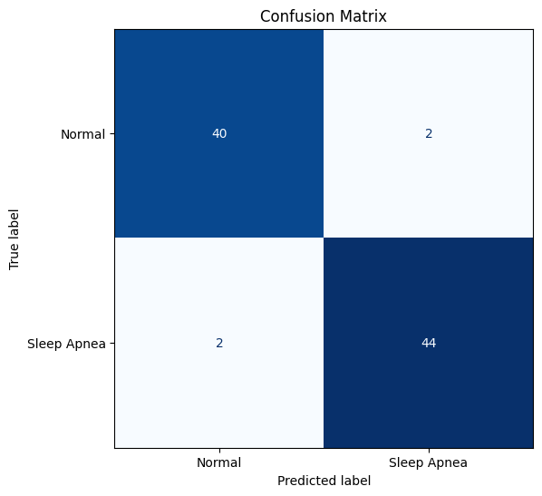
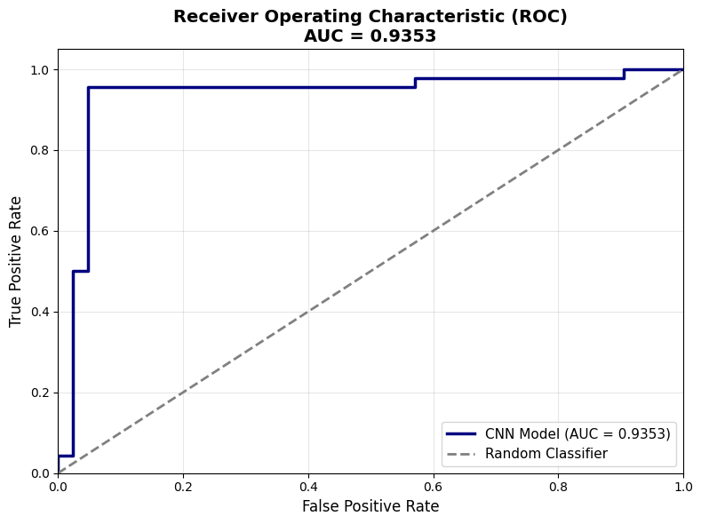
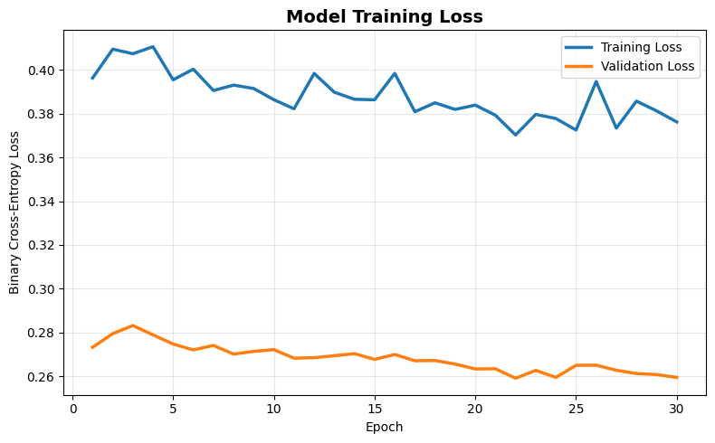

# ECG-Based Sleep Apnea Detection using Deep Learning

A deep learning framework for automatic **Sleep Apnea Detection** from single-lead ECG signals using a **1D Convolutional Neural Network (CNN)**. This project leverages physiological signal processing and deep learning techniques to classify ECG recordings as **Normal** or **Sleep Apnea**.

---

## Project Overview

Sleep apnea is a common sleep disorder characterized by repeated interruptions in breathing during sleep. Early detection is essential to reduce associated cardiovascular and neurological risks.

This project presents an end-to-end deep learning pipeline that:

- Preprocesses ECG signals
- Normalizes physiological data
- Trains a 1D CNN classifier
- Evaluates model performance using multiple metrics
- Visualizes results through ROC analysis and confusion matrices

---

## Key Features

- 1D CNN architecture for ECG classification
- ECG signal normalization and preprocessing
- Binary classification (Normal vs Sleep Apnea)
- Automatic model checkpointing
- Learning rate scheduling
- Early stopping
- ROC Curve and AUC analysis
- Confusion Matrix
- Classification Report

---

## Dataset

**Source:** PhysioNet Apnea-ECG Database

The dataset contains ECG recordings collected from subjects during sleep and is widely used for sleep apnea research.

> **Note:** The dataset is **not included** in this repository due to licensing and distribution restrictions.

---

## Repository Structure

```text
Biosignal_ECG_Sleep_Apnea_Project
│
├── data/
│   └── README.md
│
├── docs/
│   ├── README.md
|   ├── PPT.pptx
|   ├── Biosignal_Final_Submission_TC_Adithya
│
├── images/
│   ├── Confusion_Matrix.png
│   ├── ROC.png
│   ├── Training_Loss.png
│   └── README.md
│
├── models/
│   └── README.md
│
├── notebooks/
│   ├── ECG_1.ipynb
│   └── README.md
│
├── results/
│   ├── metrics.txt
│   └── README.md
│
├── requirements.txt
├── LICENSE
├── README.md
└── .gitignore
```

---

## Model Architecture

The implemented deep learning pipeline consists of:

- Input ECG Signal
- 1D Convolution Layer (32 filters)
- Max Pooling
- 1D Convolution Layer (64 filters)
- Max Pooling
- 1D Convolution Layer (128 filters)
- Max Pooling
- Global Average Pooling
- Dense Layer
- Dropout
- Sigmoid Output Layer

---

## Performance

| Metric | Score |
|---------|-------|
| Test Accuracy | **95.45%** |
| AUC Score | **0.9353** |
| Precision | **95.45%** |
| Recall | **95.45%** |
| F1 Score | **95.45%** |

---

## Results

### Confusion Matrix



---

### ROC Curve



---

### Training Loss



---

## Installation

Clone the repository

```bash
git clone https://github.com/adithya-chakravarthi-02/Biosignal_ECG_Sleep_Apnea_Project.git
```

Install the required dependencies

```bash
pip install -r requirements.txt
```

---

## Usage

Launch Jupyter Notebook

```bash
jupyter notebook
```

Open

```text
notebooks/ECG_1.ipynb
```

Run all cells sequentially to reproduce the preprocessing, model training, and evaluation pipeline.

---

## Technologies Used

- Python
- TensorFlow / Keras
- NumPy
- Pandas
- Scikit-learn
- Matplotlib
- Jupyter Notebook

---

## Future Improvements

- CNN-LSTM hybrid architecture
- Cross-validation experiments
- Hyperparameter optimization
- Multi-class sleep stage analysis
- Deployment as a lightweight inference application

---

## License

This project is released under the **MIT License**.

---

## Acknowledgements

- PhysioNet Apnea-ECG Database
- TensorFlow
- Scikit-learn
- Biomedical signal processing research community
